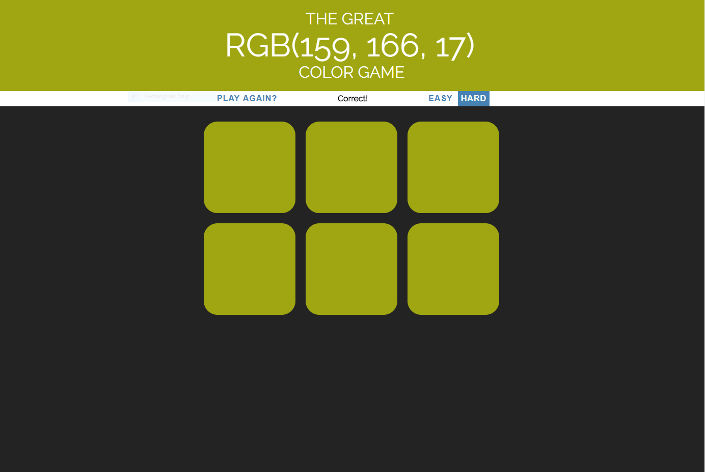

# ColorGame

Um projeto básico utilizando conhecimentos de HTML, CSS e Javascript.

O jogo consiste em o jogador receber um valor RGB e quadrados coloridos. Um dos quadrados tem a cor que representa o RGB dado. O objetivo é escolher este quadrado na menor quantidade de tentativas.

